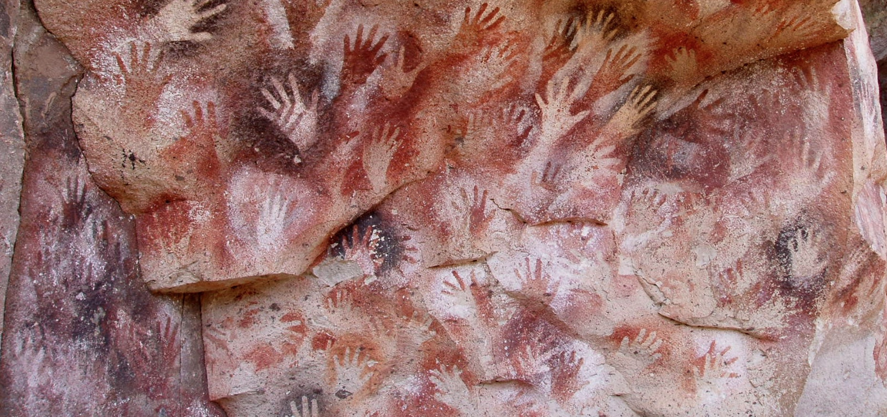
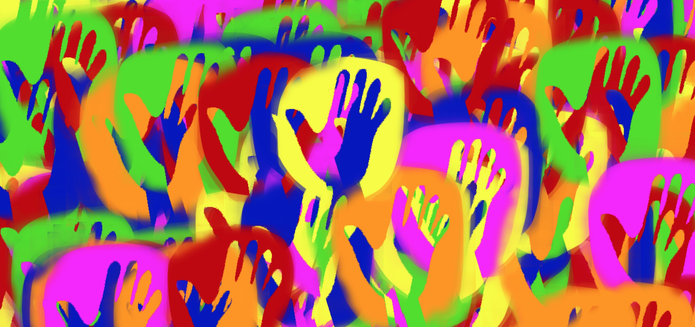

# Página de las Manos

[Cueva de las Manos](https://en.wikipedia.org/wiki/Cueva_de_las_Manos) is a cave in Argentina that is decorated with hundreds of prehistoric hand imprints.

The image of the cave left a deep impression on me. I found it to be an eerie and moving monument to the human impulse to assert one's presence, and I wondered what a digital representation for this would be like. I also really enjoyed the emergent textures that were created by overlaying stenciled hands on each other.

Página de las Manos is a web page that lets visitors make their mark. Clicking on the page will place a hand print in a random color on the canvas. If multiple people are placing prints at the same time everyone will see hand prints appear in real time.

When transferring a physical object to a digital project, I wanted to consider the affordances of the medium. It is obviously impossible to exactly recreate the original cave in a digital setting, so what unique contributions to experience could digital provide?

My thinking landed on two main aesthetic choices:

1. The color of the hands should be fully saturated primary colors. This is something the physical world rarely provides. For instance the red coming from your screen is most likely more vibrant than most reds you see in nature.

2. Where the cave has physical limits in dimension, the digital canvas can extend indefinitely in all directions.

## Development

The work is a node app that leverages nedb and websockets to create a realtime exchange of presence between concurrent visitors. the p5js framework is used to render the images.

Using the knn classifier in the ml5 library, the site can recognize and capture one of three hand gestures: peace sign ✌️, horns 🤘, or open palm ✋.

The work is currently hosted on Glitch.

## Set up

To run this work clone the git repo and run `npm install` and `node index.js` from the project root.

## Going Forward

I can see this project developing in a few directions...

1. **Machine Learning**: I'd like to continue to develop the machine learning and switch out the knn classifier for the handpose library. Additionally, I'd like someone to generate their own mark using some wizard-like process before landing on the page to place it.

2. **Infinite Canvas**: I would like the canvas to extend infinitely in all directions to allow visitors to explore the canvas kind of like one would browse a google map. I am not sure how this would work though, I haven't seen an example of an infinite canvas in p5 yet.

3. **SVG**: Right now the project uses .png files but SVG's would allow for zooming up and down the z-axis, so one could create imprints at different scales and create a sort of recursive feeling.

There are other considerations such as when to clear the canvas and start fresh again. The work could also be given different "rooms" that would allow for site/screen specific instances.

The site is starting to get more "heavey", so moving it from Glitch to a platform like heroku or AWS might be needed soon.

## Visit

To experience Página de las Manos visit this link: [https://jaymollica-pagina.glitch.me/](https://jaymollica-pagina.glitch.me/)

